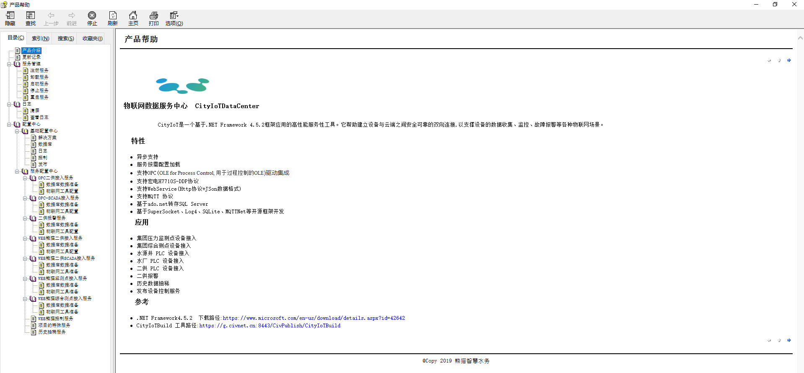

 
# 物联网数据服务中心
  &ensp;&ensp;&ensp;CityIoT是一个基于.NET Framework 4.5.2框架应用的高性能服务性工具。它帮助建立设备与云端之间安全可靠的双向连接,以支撑设备的数据收集、监控、故障报警等各种物联网场景。 

## 特性

- 异步支持 
- 服务按需配置加载
- 支持OPC(OLE for Process Control, 用于过程控制的OLE)驱动集成
- 支持宏电H7710S-DDP协议
- 支持WebService(Http协议+JSon数据格式)
- 支持MQTT 协议
- 基于ado.net转存SQL Server
- 基于SuperSocket、Log4、SQLite、MQTTNet等开源框架开 

## 应用

- 集团压力监测点设备接入
- 集团综合测点设备接入
- 水源井 PLC 设备接入
- 水厂 PLC 设备接入
- 二供报警
- 历史数据抽稀
- 发布设备控制服务

## 参考
- .NET Framework4.5.2  下载路径:[https://www.microsoft.com/en-us/download/details.aspx?id=42642](https://www.microsoft.com/en-us/download/details.aspx?id=42642)

- 请下载工具查看帮助文档

